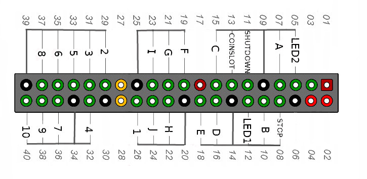

# Pi_Button_MP3Player

A simple MP3 Player using a Raspberry Pi and multiple buttons, and LEDs.

All buttons are connected between gpios and gnd, LEDs are connected between gpios, with suitable resistors, and gnd (see LAYOUT.jpg)

## Wiring

10 button switches for letters A to J, 10 button switches for numbers 1 to 10. 2 button required for STOP and SHUTDOWN.

A coin slot switch also connects between gpio and gnd. (can be disabled in the software)

Select a song (upto 100), stored in home/pi/Music, by choosing a LETTER and then a number, eg A3.

Can be operated in Continuous Play Mode. Press Button B for 5 seconds to operate. It will play tracsk until STOP pressed for 5 seconds.
In Continuous Play Mode: - A will play previous track, C will play next track, D will skip 10 tracks back, E will skip 10 tracks forward.

